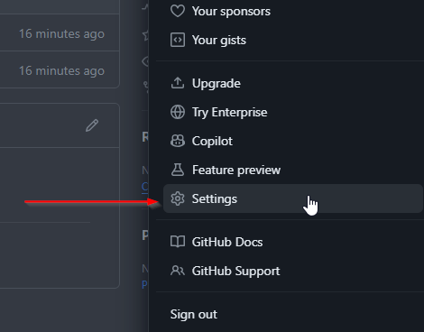
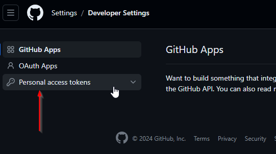
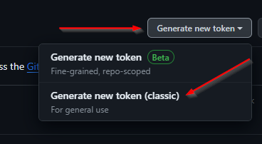

# learning-linux
just a repo of notes and scripts as I'm learning more about Linux and managing Linux systems

## Installing Vanilla Debian

[WIP]

### Installing CLI version

Make sure to unselect "Debian desktop environment" as well as the default GNOME option and only select "SSH server" and "standard system utilities"


### Installing the GUI

Make sure to select the top "Debian desktop environment" from the top of the list as well as which desktop environment version to install (GNOME is default)

## Using VMWare - Networking
When you right click on the virtual machine (or are setting it up for the first time) you must select the network adapter and choose VMnet0 from the "Custom" option for network connections. VMnet0 is a bridged network so it will show up on your network that the host computer is connected to.


## Install Nala package manager
Nala is a package manger that replaces apt. It is much easier to manage and download dependencies as well as see problems before they occur.

`sudo apt install nala`

now any installation can be done through nala (`sudo nala install <PACKAGE NAME>`)

## Establishing SSH connection

Run this command to install open ssh:

`sudo nala install openssh-server`

Check the service is running by running this command:

`sudo systemctl status ssh`

## Setting power settings and persistance
In my case I'm setting this up on a laptop as a server system so we need to set the power settings so that it never goes into hibernate and set the system configuration so that it stays on when the lid is closed.

First, let's set the power settings:

### Disabling Suspend and Hibernation

`sudo systemctl mask sleep.target suspend.target hibernate.target hybrid-sleep.target`

after rebooting, you can check to make sure the status has changed by running the following command:

`sudo systemctl status sleep.target suspend.target hibernate.target hybrid-sleep.target`

Each item shown should show as inactive

### Disabling Suspend when the lid closes

Next, we will modify the system file so that the system stays on when the lid is closed.
`cd /etc/systemd'

Open the configuration file in vi (vim)
`vi logind.conf`

We are going to change the variable `HandleLidSwitch`, `HandleLidSwitchExternalPower`, and optionally `HandleLidSwitchDocked` from `suspend` to `ignore` and removing the `#` (comment) before each line.

Then save the file.

After making these changes, make sure to reboot.

reboot using the following command:

`sudo reboot`

## Connecting to the GUI over LAN

`sudo nala install xrdp`

`sudo systemctl enable xrdp`

`sudo ifw allow from any to any port 3389`

## Install neovim (nvim)

Neovim is a version of vim that is better suited to extendability using plugins written in the Lua language. vi comes pre-installed with debian but if you plan to do any kind of programming or lots of text editing via the terminal, it might be helpful to have available.

`sudo nala install neovim`

# Dotfile Backup
In this section, we will discuss the methods and commands required to create a system configuration backup using the --bare git repo method.
See the article written by Atlassian for reference: https://www.atlassian.com/git/tutorials/dotfiles

First, initialize a bare git repo in a given directory (typically, this is done in the home directory)

`git init --bare $HOME/dotfiles`

Next, create an alias in your .bashrc file which will be used as a shortcut to access this --bare repository. In this case we are naming the alias "dotfile"

`alias dotfile='/usr/bin/git --git-dir=$HOME/.cfg/ --work-tree=$HOME'`

alternatively, you can use this command:
`echo "alias dotfile='/usr/bin/git --git-dir=$HOME/dotfile/ --work-tree=$HOME'" >> $HOME/.bashrc`

Next, we need to set the configuration of the repository to not show any unstaged files. (this is because we are using our entire home directory as the working tree and do not need all of those files to show in every git status - or rather dotfile status command)

`dotfile config --local status.showUntrackedFiles no`

Once these things are set up, now we can start committing changes to the repo when we make changes to our dotfiles.

```
dotfile status
dotfile add .vimrc
dotfile commit -m "add vimrc"
```

Now, before you push, you must authenticate the instance of git to push the changes to github. There are several ways of doing this, but the way that I'm going to describe below is using a personal access token over https. (see [Authenticating Git](#Authenticating-Git) below)

## Removing items from the dotfile repo

If you would like at any time to remove a file from being tracked by the repository (though not delete the file itself) use the following command:

`dotfile rm --cached .bashrc`

This would remove .bashrc from being tracked by the repository, but would not delete .bashrc from the file system. After doing this, then commit the change and push.

## Creating Branches

It may be helpful to have several different variations of dotfile configurations to choose from all stored in the same place. For instance, you may have a set of dotfiles optimized for a desktop computer, while another set of files for a server. One for Debian linux and another for Arch. Each of these sets of dotfiles can be kept in separate branches to keep their settings sepearte from one another.

`dotfile checkout -b <BRANCH NAME>`

This command creates a new branch as a copy of the current working HEAD in the Git repository and moves the HEAD to that branch. Any commits that you do after this will be committed to the new branch.

To switch between different branches, use the `dotfile checkout <BRANCH NAME>` command.

## Authenticating Git

Next, we are going to set up authentication on the system to allow us to push changes to our dotfiles to Github.

See this article for reference: https://www.squash.io/how-to-authenticate-git-push-with-github-using-a-token/

The first step is to go into your profile settings on Github.



On the settings page, select the page on the bottom left that says "Developer settings" and select "Personal access tokens". Select Tokens (classic) from the dropdown.



Next, select "Generate new token" from the top right and "Generate new token (classic)" from the dropdown menu that appears.



After generating the token, copy the token to a text file. Next nagivate back to the dotfile repository and copy the https link. Paste this into the text file as well. Edit the text file into the below format.

`https://<TOKEN>@github.com/<username>/<repository>.git`

Copy this link and paste it into this command.

`dotfile remote set-url origin <REMOTE_URL>`

Now, you are properly authenticated to push the changes to the remote repository.

`dotfile push origin main`

Alternatively, if you're setting up a new branch on the repo, you can configure the upstream branch with this command:

`dotfile push --set-upstream origin <BRANCH NAME>`

# Installing Applications

## BTop

BTop is a cleaner and more powerful implementation of the standard `top` command which provides process statistics in the terminal. btop provides a more intuitive view to be able to monitor processes and computer performance.

Install with this command
`sudo nala install btop`

Run with this command
`btop`

