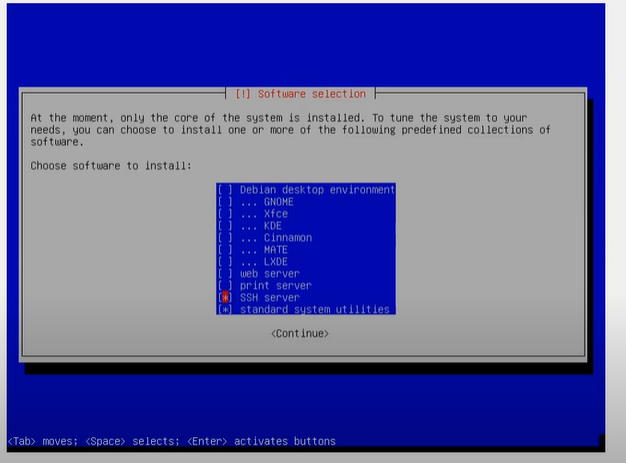

# learning-linux
just a repo of notes and scripts as I'm learning more about Linux and managing Linux systems

## Installing Vanilla Debian

### Installing CLI version

Make sure to unselect "Debian desktop environment" as well as the default GNOME option and only select "SSH server" and "standard system utilities"

## Using VMWare - Networking
When you right click on teh virtual machine (or are setting it up for the first time) you must select the network adapter and choose VMnet0 from the "Custom" option for network connections. VMnet0 is a bridged network so it will show up on your network that the host computer is connected to.

## Connecting to the GUI over LAN

