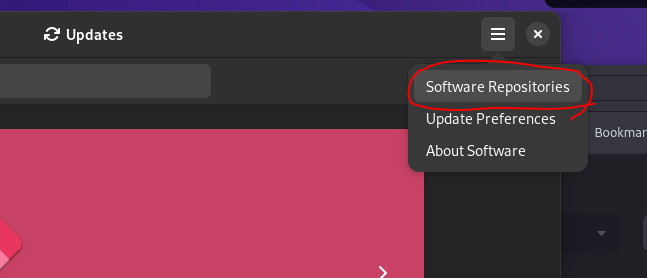

# Installing NVIDIA drivers

Just gathering information about this right now.

This link is the official link from Debian: https://wiki.debian.org/NvidiaGraphicsDrivers

This link may be helpful: https://docs.kinetica.com/7.1/install/nvidia_deb/

This video may be helpful as well: https://www.youtube.com/watch?v=K72XJHurdUY

## Enable non-free repositories

Go into the software client and click on the hamburger icon and select "Software Repositories"

When the window opens, make sure all the check boxes in the Debian Software tab are checked. This includes the non-free dependencies and software

Next reload the repositories.

## Determine your hardware
running the lspci command views all of the devices that your system is using. You can use the grep command to look specifically for the graphics device by using the following command:

`lspci | grep VGA`

## Install nvidia driver
Now that we have the repos set up, we can install the nvidia driver

`sudo nala install nvidia-driver`

# Looking Glass

This link is the official website for Looking Glass:
https://looking-glass.io

This software allows you to use a virtual machine but also pass through
the hardware of the host machine including the GPU.